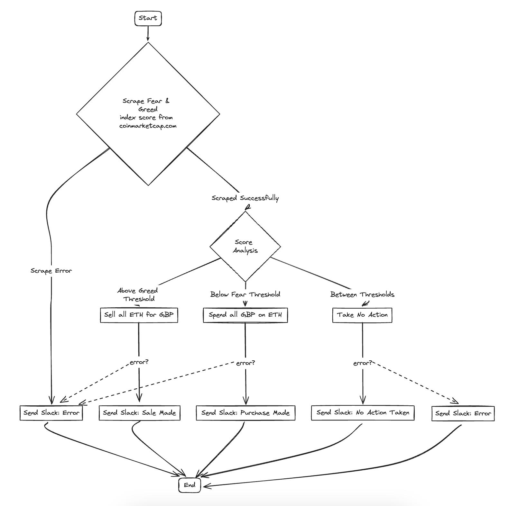

# About

This repo is a project for automating crypto trades via [coinbase.com](https://coinbase.com). It uses a simple decision tree that parses the [CoinMarketCap](https://coinmarketcap.com/) fear and greed index to determine whether to buy, sell or hold.

## Flow

## Technology Choices
- Go
- Colly for scraping
- Coinbase Advanced Trade API
- Slack API for notifications

## Build/Run Docker Container

- Build Docker Image: `docker image build -t get-rich-or-die-trying/send-it:latest -f ./cmd/send-it/Dockerfile .`
- Run Docker Image as container: `docker run -e IS_REMOTE_ENVIRONMENT='1' --env-file .env get-rich-or-die-trying/send-it:latest`

## Environments

- Code is deployed on [Northflank](https://northflank.com/)
